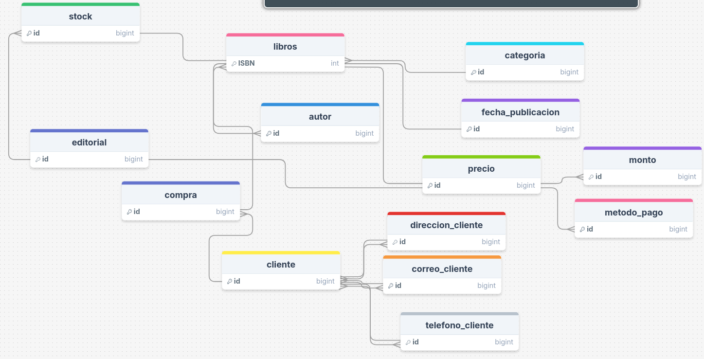

# Examen bases de datos e introduccion al backend 

## Parte 1: Normalización

A continuación, se te proporciona una tabla inicial que contiene información de libros, autores, clientes, pedidos y transacciones. Debes aplicar el proceso de normalización hasta la Tercera Forma Normal (3FN). Presenta cada paso de normalización con su justificación.

## Parte 2: Diagrama Conceptual de Entidad-Relación
Utilizando las entidades identificadas en el proceso de normalización, diseña un Diagrama Conceptual de Entidad-Relación (E-R) que represente la estructura lógica de la base de datos de la tienda de libros.

Asegúrate de representar correctamente las relaciones entre las entidades, sus cardinalidades y cualquier restricción necesaria.

## Parte 3: Diagrama UML E-R
A partir del diagrama conceptual, crea un Diagrama UML E-R que represente la estructura final de la base de datos de la tienda de libros.

Debes incluir:

- Entidades con sus atributos claramente definidos.
- Relaciones entre las entidades, especificando las cardinalidades.
- Indicaciones de las claves primarias y foráneas.

### fase conceptual: 
debido al contexto del caso se nos brinda una tabla cuyas tablsa principales y sus relaciones se pueden dividir en la siguiente imagen como parte conceptual, tiene sus debidas relaciones y nombres de tablas principalmente sin tener en cuenta la parte de llas relaciones y normalizacion.

Como podemos evidenciar, se define una cantidad total de 13 tablas, sin tener en cuenta por ahora las tablas auxiliares ya que a pesar de que todas estas entidades se relacionan con libros, pueden llegar a tener atributos unicos, tablas intermedias y relaciones de muchos a muchos que pueden alterar la funcionalidad de la base de datos, a su vez, momentaneamente se creò una tabla intermedia entre cliente y libros que es "compra" para poder definir las caracteristicas de la compra del cliente de libros.

### fase logica: 
En esta fase ya se tratan de definir los datos y algunas tablas intermedias.

Aqui ya se pueden los datos que se van a manejar, sus relaciones y algunas tablas auxiliares, falta por definir la parte de  la normalizacion.

### fase fisica: 
En esta parte ya se empiezan a ver las respectivas etapas de la normalizacion, donde la ultima es la fase donde ya no existe mayor redundancia y complejidad entre las tablas.

Se presenta una base de datos mucho mas estructurada con sus respetctivas tablas auxiliares, principales, relaciones, claves foraneas, tipos de datos, etc...

- fase normalizacion 1: se tratan de eliminar aquellos datos que se pueden dividir en otros tipos de  datos como direcicones, numeros de telefono o correos.

- fase de normalizacion 2: se eliminan aquellas relaciones que no tienen que ver con las claves principales de forma directa asì como lo son la fecha de publicacion con el precio del libro entre otros.

- fase de normallizacion 3: se eliminan todas relaciones tansitivas entre las claves primarias y columnas no clave.

# Diagrama Final:

